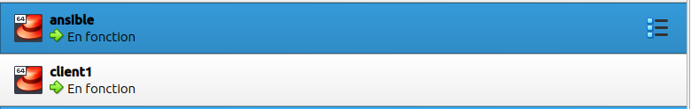

Mini Projet Ansible : Créer un rôle webapp
=============================================


Vous avez reçu la demande d'une equipe qui souhaiterait utiliser votre playbook webapp, mais sous forme de rôle car sous cette forme ils pourront mieux variabiliser et adapter à leur situation

Leur objectif est que votre rôle possède un playbook tests afin de leur permettre de tester rapidement votre rôle et ainsi l'intégrer à leur process de déploiement.

Vous la réalisation de ce projet devez:
- Créer un cluster (1 vm pour Ansible et 1 vm pour client)
- Créer un rôle permettant de déployer Apache à l'aide de Docker sur le **client**.
- Utiliser l'image httpd et le port 80 pour l'exposer à l'extérieur 
- Installer tout prérequis necéssaire à l'aide de yum
- Vérifier après l'exécution du playbook que Apache est bien disponible sur le port 80 
 


Prérequis
------------
Pour mener à bien ce projet nous aurons bésoin de:
 - [01 hyperviseur (virtualbox)]()
 - [02 VM sous centos 7 avec les rôles ansible et client]()

Le provisionning des 02 VM se fera à l'aide de `vagrant`
## 1- Déploiement des VMs et installation de ansible
---------------------------------------------------
```
$ mkdir vagrant && touch vagrant/{install_ansible.sh,Vagrantfile}
```
### Code vagrant de déploiement des VMs 
copier et coller le code ci-dessous dans le fichier `Vagrantfile`
```
Vagrant.configure("2") do |config|
  config.vm.define "ansible" do |ansible|
    ansible.vm.box = "geerlingguy/centos7"
    ansible.vm.network "private_network", type: "static", ip: "192.168.56.10"
    ansible.vm.hostname = "ansible"
    ansible.vm.provider "virtualbox" do |v|
      v.name = "ansible"
      v.memory = 2048
      v.cpus = 2
    end
    ansible.vm.provision :shell do |shell|
      shell.path = "install_ansible.sh"
      shell.args = ["master", "192.168.56.10"]
      shell.env = { 'ENABLE_ZSH' => ENV['ENABLE_ZSH'] }
    end
  end
  clients=2
  ram_client=2048
  cpu_client=2
  (1..clients).each do |i|
    config.vm.define "client#{i}" do |client|
      client.vm.box = "geerlingguy/centos7"
      client.vm.network "private_network", type: "static", ip: "192.168.56.1#{i}"
      client.vm.hostname = "client#{i}"
      client.vm.provider "virtualbox" do |v|
        v.name = "client#{i}"
        v.memory = ram_client
        v.cpus = cpu_client
      end
    end
  end
end

```
### Code déploiement de Ansible
--------------------------------

copier et coller le code ci-dessous dans le fichier `install_ansible.sh`
```
#!/bin/bash
yum -y update
yum -y install epel-release
yum install -y python3 git
if [ $1 == "master" ]
then

  # install ansible
  curl -sS https://bootstrap.pypa.io/pip/3.6/get-pip.py | sudo python3
  /usr/local/bin/pip3 install ansible
  yum install -y sshpass
  
  # Install zsh if needed
if [[ !(-z "$ENABLE_ZSH")  &&  ($ENABLE_ZSH == "true") ]]
    then
      echo "We are going to install zsh"
      sudo yum -y install zsh git
      echo "vagrant" | chsh -s /bin/zsh vagrant
      su - vagrant  -c  'echo "Y" | sh -c "$(curl -fsSL https://raw.githubusercontent.com/ohmyzsh/ohmyzsh/master/tools/install.sh)"'
      su - vagrant  -c "git clone https://github.com/zsh-users/zsh-syntax-highlighting.git ${ZSH_CUSTOM:-~/.oh-my-zsh/custom}/plugins/zsh-syntax-highlighting"
      sed -i 's/^plugins=/#&/' /home/vagrant/.zshrc
      echo "plugins=(git  colored-man-pages aliases copyfile  copypath zsh-syntax-highlighting jsontools)" >> /home/vagrant/.zshrc
      sed -i "s/^ZSH_THEME=.*/ZSH_THEME='agnoster'/g"  /home/vagrant/.zshrc
    else
      echo "The zsh is not installed on this server"
  fi

fi
echo "For this Stack, you will use $(ip -f inet addr show enp0s8 | sed -En -e 's/.*inet ([0-9.]+).*/\1/p') IP Address"
```
### 1.1 Déploiement des VMs (ansible , client1)
-----------------------------------------------------
Le déploiement se fera avec la commande `vagrant`
```
$ cd vagrant && vagrant up
```

```
Bringing machine 'ansible' up with 'virtualbox' provider...
Bringing machine 'client1' up with 'virtualbox' provider...
Bringing machine 'client2' up with 'virtualbox' provider...
==> ansible: Checking if box 'geerlingguy/centos7' version '1.2.27' is up to date...
==> ansible: Setting the name of the VM: ansible
==> ansible: Clearing any previously set network interfaces...
==> ansible: Preparing network interfaces based on configuration...
    ansible: Adapter 1: nat
    ansible: Adapter 2: hostonly
==> ansible: Forwarding ports...
    ansible: 22 (guest) => 2222 (host) (adapter 1)
==> ansible: Running 'pre-boot' VM customizations...
==> ansible: Booting VM...
==> ansible: Waiting for machine to boot. This may take a few minutes...
    ansible: SSH address: 127.0.0.1:2222
    ansible: SSH username: vagrant
    ansible: SSH auth method: private key
    ansible: 
    ansible: Vagrant insecure key detected. Vagrant will automatically replace
    ansible: this with a newly generated keypair for better security.
    ansible: 
    ansible: Inserting generated public key within guest...
    ansible: Removing insecure key from the guest if it's present...
    ansible: Key inserted! Disconnecting and reconnecting using new SSH key...
==> ansible: Machine booted and ready!
==> ansible: Checking for guest additions in VM...
    ansible: The guest additions on this VM do not match the installed version of
    ansible: VirtualBox! In most cases this is fine, but in rare cases it can
    ansible: prevent things such as shared folders from working properly. If you see
    ansible: shared folder errors, please make sure the guest additions within the
    ansible: virtual machine match the version of VirtualBox you have installed on
    ansible: your host and reload your VM.
    ansible: 
    ansible: Guest Additions Version: 6.1.32
    ansible: VirtualBox Version: 7.0
==> ansible: Setting hostname...
==> ansible: Configuring and enabling network interfaces...
==> ansible: Mounting shared folders...
    ansible: /vagrant => /home/gbane/Bureau/Mini-Projets/mini-projet-ansible/vagrant
==> ansible: Running provisioner: shell...
    ansible: Running: /tmp/vagrant-shell20240126-12352-e1wmpr.sh
```
### 1.2 Installation de Ansible sur la VM ansible
```
ansible: Collecting ansible
    ansible:   Downloading ansible-4.10.0.tar.gz (36.8 MB)
    ansible:   Preparing metadata (setup.py): started
    ansible:   Preparing metadata (setup.py): finished with status 'done'
    ansible: Collecting ansible-core~=2.11.7
    ansible:   Downloading ansible-core-2.11.12.tar.gz (7.1 MB)
    ansible:   Preparing metadata (setup.py): started
    ansible:   Preparing metadata (setup.py): finished with status 'done'
    ansible: Collecting jinja2
    ansible:   Downloading Jinja2-3.0.3-py3-none-any.whl (133 kB)
    ansible: Collecting PyYAML
    ansible:   Downloading PyYAML-6.0.1-cp36-cp36m-manylinux_2_17_x86_64.manylinux2014_x86_64.whl (677 kB)
    ansible: Collecting cryptography
    ansible:   Downloading cryptography-40.0.2-cp36-abi3-manylinux_2_17_x86_64.manylinux2014_x86_64.whl (3.7 MB)
    ansible: Collecting packaging
    ansible:   Downloading packaging-21.3-py3-none-any.whl (40 kB)
    ansible: Collecting resolvelib<0.6.0,>=0.5.3
    ansible:   Downloading resolvelib-0.5.4-py2.py3-none-any.whl (12 kB)
    ansible: Collecting cffi>=1.12
    ansible:   Downloading cffi-1.15.1-cp36-cp36m-manylinux_2_5_x86_64.manylinux1_x86_64.whl (402 kB)
    ansible: Collecting MarkupSafe>=2.0
    ansible:   Downloading MarkupSafe-2.0.1-cp36-cp36m-manylinux_2_5_x86_64.manylinux1_x86_64.manylinux_2_12_x86_64.manylinux2010_x86_64.whl (30 kB)
    ansible: Collecting pyparsing!=3.0.5,>=2.0.2
    ansible:   Downloading pyparsing-3.1.1-py3-none-any.whl (103 kB)
    ansible: Collecting pycparser
    ansible:   Downloading pycparser-2.21-py2.py3-none-any.whl (118 kB)
    ansible: Building wheels for collected packages: ansible, ansible-core
    ansible:   Building wheel for ansible (setup.py): started
    ansible:   Building wheel for ansible (setup.py): finished with status 'done'
    ansible:   Created wheel for ansible: filename=ansible-4.10.0-py3-none-any.whl size=60568512 sha256=a01c0d714a4eca390ec24c538bf17a41893fd36ad16c095c16e2ba25402ecd0f
    ansible:   Stored in directory: /root/.cache/pip/wheels/fd/0b/73/1536be1c3fe3e172e003fa05da85642fa29210760ca928348b
    ansible:   Building wheel for ansible-core (setup.py): started
    ansible:   Building wheel for ansible-core (setup.py): finished with status 'done'
    ansible:   Created wheel for ansible-core: filename=ansible_core-2.11.12-py3-none-any.whl size=1960962 sha256=1b1cbe45750dac5b918565c640cf7b5ac3fe1d76dfbcfcc11fe72297502b3aba
    ansible:   Stored in directory: /root/.cache/pip/wheels/de/a2/0a/cfe72f018b6d3845ab54b29259c0ac20eb169d18063770c09e
    ansible: Successfully built ansible ansible-core
    ansible: Installing collected packages: pycparser, pyparsing, MarkupSafe, cffi, resolvelib, PyYAML, packaging, jinja2, cryptography, ansible-core, ansible
    ansible: Successfully installed MarkupSafe-2.0.1 PyYAML-6.0.1 ansible-4.10.0 ansible-core-2.11.12 cffi-1.15.1 cryptography-40.0.2 jinja2-3.0.3 packaging-21.3 pycparser-2.21 pyparsing-3.1.1 resolvelib-0.5.4
```
### 1.3 Vérification


## 2 - Création des dossiers et fichiers utiles

Maintenant que les prérequis sont en place nous pouvons créer nos différents dossiers `group_vars`, `host_vars` et `rôles`

```
$ mkdir mini-projet-ansible && cd mini-projet-ansible
$ mkdir -p host_vars group_vars roles
```
### 2.1 Rôles des répertoires
------------------------
 - **group_vars** est le répertoire qui permet de définir des variables pour les groupes d'hôtes et de déployer des `plays/tasks` Ansible sur chaque hôte/groupe. Les fichiers dans le répertoire `group_var` doivent correspondre aux noms de groupes defini dans le fichier d'inventaire.

- **host_vars** est un répertoire qui permet de définir des variables pour chaque hôte spécifique.

- **roles** Ce répertoire permet de charger automatiquement les `variables`, `fichiers`, `tâches`, `handlers` et autres `artefacts` Ansible associés en fonction d'une structure de fichiers connue. Après avoir regroupé notre contenu en rôles, nous pouvons facilement les réutiliser et les partager avec d'autres utilisateurs.

> **NB:** Le nom des fichiers `YAML` dans `group_vars` doivent correspondre au groupe défini dans l'inventaire et les fichiers `YAML` dans `host_vars` doivent également être nommés exactement comme les hôtes de l'inventaire.

### 2.2 - Création des différents fichiers

Procédons à la création des fichiers ci-dessous:

- `prod.yml` dans le dossier `group_vars`
- `client2.yml` dans le dossier `host_vars`
- `deploy.yml`, `inventory.yml` et `ansible.cfg` dans le dossier racine `mini-projet-ansible`

```
$ touch mini-projet-ansible/{deploy.yml, inventory.yml, ansible.cfg}
$ touch mini-projet-ansible/group_vars/prod.yml
$ touch mini-projet-ansible/host_vars/client2.yml
```
#### 2.2.1 Contenu et Rôles des fichiers
----------------------------------
Passons à l'édition de nos fichiers précédemment crées.

**a - group_vars/prod.yml**
- `prod.yml` c'est dans ce fichier que nous allons déclarer les variables à appliquer au groupe nommé `prod` 

*copier et coller le contenu ci-dessous*
```
ansible_ssh_extra_args: '-o StrictHostKeyChecking=no'
```
cet argument aide `ansible` à contrôler les connexions aux machines. mettre cet argument à `no` invite `ssh` à ajouter automatiquement les clés d'hôte dans le fichiers `~/.ssh/known_hosts`. En le faisant ainsi on désactive la validation de la clé au niveau de `l'inventaire` , on peut aussi le faire globalement en ajoutant `host_key_checking = False` dans `/etc/ansible/ansible.cfg` ou `ansible.cfg` à la racine du projet

**b - host_vars/client2.yml**

- `client2.yml` c'est dans ce fichier que seront déclarés les variables liés à l'hôte ` client2`, il s'agit de son adresse ip et des paramètres de connexion. on n'a pas bésoin de spécifier le mot de passe car à l'installation des VMs il y'a eu un échange des clés `SSH` entre les différentes VMs

```
ansible: SSH address: 127.0.0.1:2222
ansible: SSH username: vagrant
ansible: SSH auth method: private key
ansible: 
ansible: Vagrant insecure key detected. Vagrant will automatically replace
ansible: this with a newly generated keypair for better security.
ansible: 
ansible: Inserting generated public key within guest...
ansible: Removing insecure key from the guest if it's present...
ansible: Key inserted! Disconnecting and reconnecting using new SSH key...
```

*copier et coller le contenu ci-dessous*
```
---
ansible_host: 192.168.56.12
ansible_user: vagrant
```
**c - inventory.yml**
- `inventory.yml` est le fichier dans lequel nous allons faire l' inventaire de nos `hôtes`, `groupe d'hôtes` et de la `relation d'enfant entre groupe`.

*contenu inventory.yml*
```
all:
  children:
    prod:
      hosts:
        client2:
```   

`all` est le parent de tous les groupes , il à pour enfant `(children)` le groupe `prod` et `l'hôte` `client2` appartient au groupe `prod`.


*vérification*
```
mini-projet-ansible$ ansible-inventory -i inventory.yml --graph
@all:
  |--@ungrouped:
  |--@prod:
  |  |--client2
```

**d - ansible.cfg**

- `ansible.cfg`: Gestion des fichiers de configuration Ansible. C'est le cerveau et le cœur d'Ansible, le fichier qui régit le comportement de toutes les interactions effectuées par le nœud de contrôle.
`Ansible` commence par lire dans le répertoire courant pour trouver `ansible.cfg`, s'il ne trouve pas il cherche dans le **home directory** de l'utilisateur courant sinon il cherche dans `/etc/ansible/ansible.cfg`.  `ansible.cfg` dans les projets sera surchargé par la configuration de base `/etc/ansible/ansible.cfg`
> **NB:** `/etc/ansible/ansible.cfg` ne doit être modifier en aucun cas sinon une quelconque modification pourra impacter toute l'insfrastructure


*contenu du ansible.cfg*
```
[defaults]
host_key_checking = False
inventory = $PWD/inventory.yml
roles_path = $PWD/roles
deprecation_warnings=False
```

- `host_key_checking = False` : Désactive la validation de la clé publique lors des connexion `ssh`
- `inventory` : Permet de localiser le fichier inventaire
- `roles_path` : Permet de localiser le Rôle `Webapp`
- `deprecation_warnings=False` : Désactive les message d'avertissement

**e - deploy.yml**
- `deploy.yml` est notre `playbook`, c'est ce fichier qui indique à `Ansible` les tâches à exécuter sur les hôtes ,c'est donc dans ce même fichier que nous allons inclure notre rôle `webapp`


*contenu du deploy.yml*
```
---
- name: Webapp deployment in Production
  hosts: prod
  become: true
  roles:
    - webapp
```
*Points à noter*
- `hosts`: les hôtes sur lesquels seront exécutées les tâches ici ce sont les hôtes du groupe `prod` 
- `become`: Permet d'exécuter des tâches avec les privilèges d'un autre user tel que `root` avec `sudo` ou `su`.
- `roles`: Permet d'inclure des rôles


## 3 - Rôle Webapp
### 3.1 - Création de notre Rôle Webapp
Le rôle est un élément `Ansible` comprenant une structure de fichiers et a pour but de faciliter la réutilisation, la modularité de la configuration des `playbook`.

nous allons utiliser la commande `ansible-galaxy` pour créer la structure de notre rôle :
```
ansible-galaxy init roles/webapp
```
Résultat
```
Role roles/webapp was created successfully
```
### 3.2 - Structure du rôle webapp
```
webapp/
├── defaults
│   └── main.yml
├── files
├── handlers
│   └── main.yml
├── meta
│   └── main.yml
├── README.md
├── tasks
│   └── main.yml
├── templates
├── tests
│   ├── inventory
│   └── test.yml
└── vars
    └── main.yml

9 directories, 8 files
```
Un rôle `Ansible` suit une structure de répertoires définie, un rôle est nommé par le répertoire de niveau supérieur. les sous-répertoires contiennent des fichiers `YAML`, nommés `main.yml` à l'exception de `files` et `templates`.

### 3.3 - Rôle des répertoires
- `defaults`: contient les variables par défaut pour le rôle.
- `tasks`: contient les taches à appliquer.
- `handlers`: contient les handlers, les actions à déclencher.
- `vars`: contient d'autres variables pour le rôle.
- `files`: contient les fichiers variabilisés à copier sur le serveur cible.
- `templates`: contient des modèles (jinja2) qui peuvent être déployés via ce rôle.
- `meta`: définit certaines métadonnées pour ce rôle.
- `README.md`: inclut une description générale du fonctionnement du rôle.
- `tests`: contient un playbook (on peut cependant déposer notre playbook à la racine du projet ou dans un dossier sous un nom différent).

### 3.4 - Mise en place de notre Webapp
Nous allons commencer par supprimer les répertoires dont nous n'avons pas bésoin ici. **(files, handlers, meta)**
```
$ rm -rf roles/webapp/{files,handlers,meta}
```
#### 3.4.1 - définition des variables par défaut *(defaults/main.yml)*
```
---
# defaults variables
system_user: test
webapp_port: 80
apache_port: 80
file_template: index.html.j2
ansible_python_interpreter: /usr/bin/python3
```

- `system_user`: l'utilisateur système par défaut
- `webapp_port`: le port d'écoute au niveau de l'hôte
- `apache_port`: le port d'écoute au niveau du conteneur
- `file_template`: le fichier `jinja2` par défaut dans le répertoire `templates`
- `ansible_python_interpreter`: on défini `python3` comme l'interpreter par défaut

#### 3.4.2 - définition des tâches dans le répertoire tasks
Nous allons créer les fichiers `centos-setup.yml` et `install-docker.yml` dans le répertoire `tasks` en plus du fichier `main.yml`.
```
$ touch tasks/{centos-setup.yml,install-docker.yml}
```
**Structure du répertoire tasks**
```
roles/webapp/tasks/
├── centos-setup.yml
├── install-docker.yml
└── main.yml
```
- `main.yml` : c'est le fichier principal de nos tâches, dans ce fichier nous feront appel aux tâches définies dans les fichiers `centos-setup.yml` et `install-docker.yml` avec l'argument `include_tasks`. Ces deux tâches vont d'abord préparer le système d'exploitation ,installer `docker` sur celui-ci ensuite on procède à la copie de `index.html.j2` et au déploiment du conteneur en se basant sur les valeurs définies dans le fichier `defaults/main.yml`.

**contenu de tasks/main.yml**
```
---
# tasks file for ansible-role-webapp
- include_tasks: "centos-setup.yml"
- include_tasks: "install-docker.yml"
- name: Copy website file template
  template:
    src: "{{ file_template }}"
    dest: "/home/{{ system_user }}/index.html"
- name: Create Apache container
  docker_container:
    name: webapp
    image: httpd
    ports:
        - "{{ webapp_port }}:{{ apache_port }}"
    volumes:
        - "/home/{{ system_user }}/index.html:/usr/local/apache2/htdocs/index.html"
```

- `install-docker.yml` : Ce fichier permet d'installer l'environnement necéssaire à l'exécution de docker sur notre système d'exploitation. Il installe *docker engine, docker-compose, python pour docker (docker-py)* et démarre docker en même temps que le système .

**contenu de tasks/install-docker.yml**
```
---
- name: Add docker repositories
  yum_repository:
    name: docker
    description: docker
    baseurl: https://download.docker.com/linux/centos/7/x86_64/stable
    enabled: yes
- name: Add Docker GPG Key
  rpm_key:
    key: https://download.docker.com/linux/centos/gpg
    state: present

- name: Install docker engine
  package:
    name:
      - docker-ce
      - docker-ce-cli
      - containerd.io
    state: present

- name: Install docker-compose
  get_url:
    url: https://github.com/docker/compose/releases/download/1.29.2/docker-compose-Linux-x86_64
    dest: /usr/local/bin/docker-compose
    mode: 0755
- name: Enable and Start docker
  service:
    name: docker
    state: started
    enabled: yes

- name: docker python
  pip:
    name: docker-py
    executable: pip3
```
- `centos-setup.yml` :  Ce fichier contient la tâche qui permet d'installer toutes les dépendances necéssaires à l'exécution du rôle webapp. il vérifie la distributon et la version du système d'exploitation avant d'installer les prérequis avec `yum`

**contenu de task/centos-setup.yml**
```
---
# Setup centos 7 by adding all dependencies for this role
- name: Check for the correct OS distributon and version
  fail:
    msg: The OS distributon should be centos 7
  when: ansible_distribution != "CentOS" or ansible_distribution_major_version != "7"
  
- name: Install some package and prerequisites
  package: name={{ item }} state=present
  with_items:
    - epel-release
    - wget
    - git
    - yum-utils
    - device-mapper-persistent-data
    - lvm2
    - python3
    - python3-pip    

```
#### 3.4.3 - Mise en place du template
commençons par créer le fichier `index.html.j2` sous le répertoire `templates`
```
$ touch templates/index.html.j2
```
**contenu du fichier templates/index.html.j2**
```
Bienvenue sur le site {{ ansible_hostname }}
```
`ansible_hostname` sera remplacé lors de la copie par le hostname de l'hôte dans le groupe `prod` à savoir `client2`

#### 3.4.4 - Mise en place du test
Pour tester notre deploiement nous allons copier le code ci-dessous dans le ficher `tests/test.yml`
```
---
- name: Test Website
  hosts: prod
  remote_user: vagrant
  tasks:
  - name: Website Test
    uri:
      url: http://192.168.56.12
      status_code: 200
```
Nous allons tenter une connexion au site via l'url `http://192.168.56.12` si la réponse est 200 ça veut que tout est bon sinon il y'a un problème.

**Test de connection au site**
```
ansible-playbook -i inventory.yml roles/webapp/tests/test.yml
```
*Résultat*

```
PLAY [Test Website] *********************************************************************************************************************************

TASK [Gathering Facts] ******************************************************************************************************************************
ok: [client2]

TASK [Website Test] *********************************************************************************************************************************
ok: [client2]

PLAY RECAP ******************************************************************************************************************************************
client2                    : ok=2    changed=0    unreachable=0    failed=0    skipped=0    rescued=0    ignored=0 
```
`ok=2` : Deux Tâches ont été exécutées `TASK [Gathering Facts]` et `TASK [Website Test]` donc la connexion est reussie 

## 4 - Déploiement du rôle webapp

### 4.1 - Test de connectivité à l'hôte du groupe Prod
```
ansible prod -i inventory.yml -m ping
```
**Résultat**
```
client2 | SUCCESS => {
    "ansible_facts": {
        "discovered_interpreter_python": "/usr/bin/python"
    },
    "changed": false,
    "ping": "pong"
}
```
### 4.2 - Déploiement de Webapp
Pour le déploiment nous allons utiliser la commande `ansible-playbook`

Le déploiment se fera sur la base des tâches définies dans le fichier `deploy.yml` et sur les hôtes définis dans le fichier `inventory.yml`. 

**a - Exécution**
```
ansible-playbook -i inventory.yml deploy.yml 
```
**b - Résultats**

*Gather Facts* 

 cette opération permet d'exécuter le module `setup` pour extraire des informations sur le système d'exploitation telles que la distributon, la version, l'architecture.. 
```
PLAY [Webapp deployment in Production] **************************************************************************************************************

TASK [Gathering Facts] ******************************************************************************************************************************
ok: [client2]
```
*Importation de tasks/centos-setup.yml*
```
TASK [webapp : include_tasks] ***********************************************************************************************************************
included: /home/vagrant/mini-projet-ansible/roles/webapp/tasks/centos-setup.yml for client2
```
*vérification de la distributon et de la version*
```
TASK [webapp : Check for the correct OS distributon and version] ************************************************************************************
skipping: [client2]
```
*Exécution de tasks/centos-setup.yml*

```
TASK [webapp : Install some package and prerequisites] **********************************************************************************************
ok: [client2] => (item=epel-release)
ok: [client2] => (item=wget)
changed: [client2] => (item=git)
ok: [client2] => (item=yum-utils)
ok: [client2] => (item=device-mapper-persistent-data)
ok: [client2] => (item=lvm2)
ok: [client2] => (item=python3)
ok: [client2] => (item=python3-pip)

```
*Importation de tasks/install-docker.yml*
```
TASK [webapp : include_tasks] ***********************************************************************************************************************
included: /home/vagrant/mini-projet-ansible/roles/webapp/tasks/install-docker.yml for client2
```
*Ajout des sources de docker*
```
TASK [webapp : Add docker repositories] *************************************************************************************************************
changed: [client2]

TASK [webapp : Add Docker GPG Key] ******************************************************************************************************************
changed: [client2]
```
*Installation et démarrage de docker*
```
TASK [webapp : Install docker engine] ***************************************************************************************************************
changed: [client2]

TASK [webapp : Install docker-compose] **************************************************************************************************************
changed: [client2]

TASK [webapp : Enable and Start docker] *************************************************************************************************************
changed: [client2]

TASK [webapp : docker python] ***********************************************************************************************************************
changed: [client2]
```
*Copie du template sur client2*
```
TASK [webapp : Copy website file template] **********************************************************************************************************
changed: [client2]
```
*Déploiement du conteneur sur client2*
```
TASK [webapp : Create Apache container] *************************************************************************************************************
changed: [client2]

```
*Récapitulatif*
```
PLAY RECAP ******************************************************************************************************************************************
client2                    : ok=12   changed=9    unreachable=0    failed=0    skipped=1    rescued=0    ignored=0   
```

- `ok=12` : 12 tâches ont été exécutées sans erreurs y compris les tâches qui n'ont apporté aucun changement à l'hôte et les tâches qui ont changé quelque chose.
- `changed=9`: 9 tâches ont été exécutées et ont apporté un changement à l'hôte
- `skipped=1`: 01 tâche n'a pas été exécuté car la condition `when` qui est `false`

## 5 - Test via navigateur


## Conclusion
À travers ce projet, nous avons pu aborder les aspects majeurs d'`Ansible`, rendant ainsi
son utilisation très simple, modulable et très puissante.
C'est un outil qui se veut simple à l'utilisation mais suffisamment puissant pour
automatiser des environnements d'applications complexes à plusieurs niveaux.